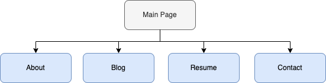
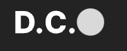
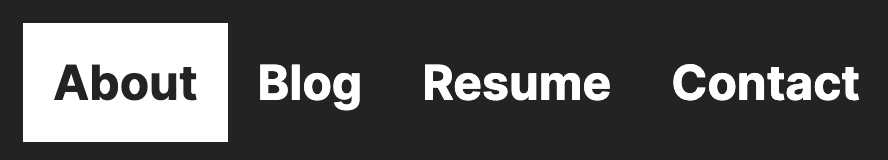

# david10382.github.io
live website: https://david10382.github.io/

github repo: https://github.com/david10382?tab=repositories

# portfolio overview 

## purpose
This is a portfolio website for the purpose of showcasing my adeptness in utilizing **Html** and **CSS** skill set for creating **websites. 

The site is designed and built to be responsive in all screen resolutions. To achieve this, a minimalist design was utilized.

As a Web Developer student, I am continually learning and adding new skills to my tech stack. It is my mission to  implement skills in creative and innovatie ways.

# sitemap

 

# functional/features

## common components found through out the site is as follows:

1. **Logo**: *that redirects to the main page* 

    

2.  **Navbar**: Responsive with hover effect *desktop screen size*

3. **handburger menu**: *mobile screen size*

    

4. **Icons & clickable email**: links to github & linkedin. Also link to email client

5. footer *clickable email opening email client*

    

# Target audience
The website is deisgned with prospective IT employers in mind. As such, it displays my current ability with tools HTML and CSS. 

I hope to hear from employers that specifically work on Website Decelopment.

<!-- Tables-->
# tech stack

|Current skills     | Skills to learn   |
|-------------------|-------------------|
|- [x]**HTML**      |- [ ] python       |
|- [x]**CSS**       |- [ ] Javascript   |
|- [x]**Sass**      |                   |
|- [x]**Git**       |                   |
|- [x]**Figma**     |                   |

<!-- Tables-->
